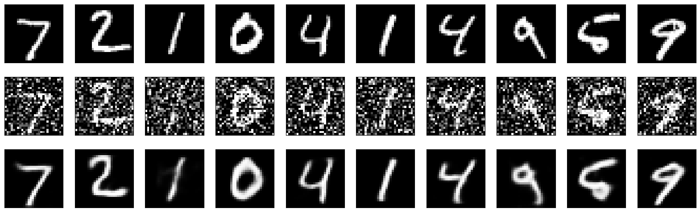

# Keras Diffusion Model for MNIST Image Denoising

Pre-processing MNIST data:

Get the MNIST dataset ready for training by scaling its pixel intensities and reshaping each image so it includes one channel. Scaling the values makes training more stable and helps the model converge sooner, while the reshape step is needed because the model input expects image-shaped tensors.

## Overview

This project builds a convolutional image reconstruction model on the MNIST handwritten digit dataset. Although the notebook refers to it as a diffusion model, the implementation is technically much closer to a denoising autoencoder than to a true diffusion model.

The workflow is:

1. Load and preprocess MNIST.
2. Add Gaussian noise to the images.
3. Build a convolutional encoder-decoder model.
4. Train the model to map noisy images to clean images.
5. Evaluate the denoised outputs visually.
6. Freeze and unfreeze layers for a fine-tuning stage.

## What the Project Does Step by Step

### 1. Environment setup

The notebook first checks that TensorFlow is available and ensures that required packages such as `numpy` and `matplotlib` are installed.

It also sets TensorFlow environment options to reduce verbose logging and disable oneDNN optimizations.

### 2. Pre-process the MNIST data

The notebook loads the MNIST dataset and prepares it for training:

- convert images to `float32`
- scale pixel values to the range `[0, 1]`
- reshape images from `(28, 28)` to `(28, 28, 1)`

This makes the data compatible with convolutional layers, which expect image tensors with channel dimensions.

### 3. Add noise to the images

Adding noise to the data:

Add Gaussian noise.

Noise is added once to make `x_train_noisy` and `x_test_noisy`, then the model is trained on noisy image to clean image pairs.

So the model is much closer to a denoising autoencoder or denoising reconstruction model than a true diffusion model.

The notebook adds Gaussian noise with a noise factor of `0.5`, then clips values back into the valid pixel range `[0, 1]`.

This creates:

- `x_train_noisy`: noisy training images
- `x_test_noisy`: noisy test images

The clean images remain the reconstruction targets.

### 4. Build the model

Building diffusion model:

I make a diffusion model with an encoder which compresses the input image into a latent representation and a decoder that reconstructs the image from this representation. The model has the Adam optimizer and binary cross-entropy loss.

#### 1. The encoder

- an input layer with the shape `(28, 28, 1)`
- two `Conv2D` layers with increasing filter sizes and ReLU activation

#### 2. The bottleneck

- a `Flatten` layer followed by a `Dense` layer with ReLU activation

#### 3. The decoder

- a `Dense` layer to expand the bottleneck representation
- `Reshape` the output to match the original image dimensions
- two `Conv2DTranspose` layers with decreasing filter sizes and ReLU activation

#### 4. Compile the model

- the Adam optimizer and binary cross-entropy loss

In the actual final code, the architecture is:

- `Input(shape=(28, 28, 1))`
- `Conv2D(16, kernel_size=(3, 3), activation='relu', padding='same')`
- `Conv2D(32, kernel_size=(3, 3), activation='relu', padding='same')`
- `Flatten()`
- `Dense(64, activation='relu')`
- `Dense(28*28*32, activation='relu')`
- `Reshape((28, 28, 32))`
- `Conv2DTranspose(32, kernel_size=(3, 3), activation='relu', padding='same')`
- `Conv2DTranspose(16, kernel_size=(3, 3), activation='relu', padding='same')`
- `Conv2D(1, kernel_size=(3, 3), activation='sigmoid', padding='same')`

## Technical Characteristics

This project includes the following technical ideas:

- convolutional image preprocessing with channel-aware input tensors
- noisy-to-clean supervised reconstruction
- encoder-decoder image modeling
- transposed convolution for image reconstruction
- latent compression through a bottleneck representation
- TensorFlow `tf.data` pipelines with caching, batching, and prefetching
- early stopping based on validation loss
- fine-tuning through layer freezing and selective unfreezing

## Why This Is Not a True Diffusion Model

A true diffusion model usually includes a multi-step forward noising process and a learned reverse denoising process across timesteps.

This notebook does not implement that full diffusion process. Instead, it:

- adds noise once
- trains directly on noisy image to clean image pairs
- predicts cleaned images in one pass

So technically this is better described as a convolutional denoising autoencoder-style model.

## Why the Optimizer and Loss Were Chosen

### Optimizer: `adam`

The notebook uses the `Adam` optimizer because:

- it is a strong default for neural network training
- it adapts learning rates automatically for different parameters
- it tends to converge faster than plain stochastic gradient descent
- it works well for convolutional reconstruction tasks without much manual tuning

This makes it a practical optimizer for an educational image denoising project.

### Loss function in the first training stage: `mean_squared_error`

In the main training stage, the actual code compiles the model with:

`diffusion_model.compile(optimizer='adam', loss='mean_squared_error')`

This choice makes sense because the model is solving a pixel-wise reconstruction problem:

- input images are normalized continuous values in `[0, 1]`
- output images are also continuous-valued pixel intensities
- the goal is to make reconstructed pixels numerically close to the clean target pixels

`mean_squared_error` is a natural choice for regression-style image reconstruction because it penalizes the squared difference between predicted and target pixel values.

### Loss function in the fine-tuning stage: `binary_crossentropy`

Later, during fine-tuning, the notebook recompiles the model with:

`diffusion_model.compile(optimizer='adam', loss='binary_crossentropy')`

This is also defensible because:

- the final layer uses `sigmoid`
- pixel values are normalized to `[0, 1]`
- binary cross-entropy is commonly used with sigmoid outputs in MNIST-style image reconstruction examples

Still, from a technical perspective, `mean_squared_error` is more directly aligned with the continuous pixel reconstruction objective. So the notebook uses two different valid losses across two training phases, but the first one is the more natural fit for regression-style denoising.

## Training Procedure

training diffusion model

The notebook trains the model with:

- `EarlyStopping(monitor='val_loss', patience=2, restore_best_weights=True)`
- `epochs=3`
- `batch_size=64`
- shuffled training
- validation on noisy test images paired with clean test images

The use of early stopping helps prevent unnecessary overtraining and restores the best validation checkpoint.

## Evaluation

evaluate the diffusion model

After training, the notebook predicts denoised images from `x_test_noisy` and visualizes three rows:

- top row: original clean images
- middle row: noisy input images
- bottom row: denoised model outputs

This makes it easy to compare how much structure the model recovers from corrupted inputs.

## Fine-Tuning

fine-tuning:

- freeze layers
- check status of layers
- unfreeze layers
- compile and train

In the fine-tuning stage, the notebook:

1. freezes all layers
2. prints each layer’s trainable status
3. unfreezes the last four layers
4. recompiles the model
5. trains again on noisy-to-clean image pairs

This demonstrates transfer-learning style control over which parts of the network remain fixed and which parts are updated.

## Packages Used

The notebook directly uses these packages:

- `tensorflow`
- `numpy`
- `matplotlib`
- `os`
- `importlib.util`
- `sys`

More specifically, it uses:

- `tensorflow.keras.datasets.mnist`
- `tensorflow.keras.layers.Input`
- `tensorflow.keras.layers.Conv2D`
- `tensorflow.keras.layers.Conv2DTranspose`
- `tensorflow.keras.layers.Flatten`
- `tensorflow.keras.layers.Dense`
- `tensorflow.keras.layers.Reshape`
- `tensorflow.keras.models.Model`
- `tensorflow.keras.callbacks.EarlyStopping`

## Files in the Repository

- `Keras-diffusionModel.ipynb` — main notebook
- `README.md` — project documentation
- `evaluation-output.png` — figure showing the evaluation results

## Figure

The repository includes the following renderable figure:

This image will render on GitHub as long as `evaluation-output.png` stays in the repository root next to `README.md`.

## Summary

This project uses MNIST to build a convolutional noisy-image reconstruction pipeline in TensorFlow/Keras. It preprocesses image data, adds Gaussian noise, trains an encoder-decoder model to recover clean digits, evaluates the results visually, and then performs a fine-tuning stage by freezing and unfreezing layers. Although named as a diffusion model in the notebook, the implementation is more accurately a denoising autoencoder-style image reconstruction model.

