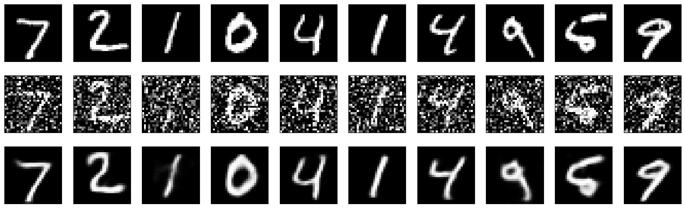

# Keras Diffusion Model for MNIST Image Denoising

## Overview

This project builds a convolutional image reconstruction model on MNIST. The notebook calls it a diffusion model, but the implementation is closer to a denoising autoencoder: noise is added once, and the model learns to map noisy images to clean ones in a single pass. A true diffusion model would use a multi-step noising process and a learned reverse process across timesteps.

Workflow:

1. Load and preprocess MNIST.
2. Add Gaussian noise to the images.
3. Build a convolutional encoder-decoder model.
4. Train the model to map noisy images to clean images.
5. Evaluate the denoised outputs visually.
6. Freeze and unfreeze layers for a fine-tuning stage.

## Preprocessing

- Convert images to `float32`
- Scale pixel values to `[0, 1]`
- Reshape images from `(28, 28)` to `(28, 28, 1)` so they fit convolutional layers

## Adding Noise

Gaussian noise with a noise factor of `0.5` is added, and values are clipped back to `[0, 1]`. This gives `x_train_noisy` and `x_test_noisy`. The clean images stay as targets.

## Model

Encoder, bottleneck, and decoder:

- `Input(shape=(28, 28, 1))`
- `Conv2D(16, (3, 3), relu, padding='same')`
- `Conv2D(32, (3, 3), relu, padding='same')`
- `Flatten()`
- `Dense(64, relu)`
- `Dense(28*28*32, relu)`
- `Reshape((28, 28, 32))`
- `Conv2DTranspose(32, (3, 3), relu, padding='same')`
- `Conv2DTranspose(16, (3, 3), relu, padding='same')`
- `Conv2D(1, (3, 3), sigmoid, padding='same')`

## Training

- Optimizer: `adam`
- Loss: `mean_squared_error` (pixel-wise reconstruction of continuous values in `[0, 1]`)
- `EarlyStopping(monitor='val_loss', patience=2, restore_best_weights=True)`
- `epochs=3`, `batch_size=64`, shuffled
- Validation on noisy test images paired with clean test images
- Data pipeline with `tf.data` caching, batching, and prefetching

## Evaluation

Top row: original images. Middle row: noisy inputs. Bottom row: denoised outputs.

## Fine-Tuning

1. Freeze all layers
2. Print each layer's trainable status
3. Unfreeze the last four layers
4. Recompile with `binary_crossentropy` (works with the sigmoid output and `[0, 1]` pixels)
5. Train again on noisy-to-clean pairs

## Packages Used

- `tensorflow` (`Conv2D`, `Conv2DTranspose`, `Dense`, `Flatten`, `Reshape`, `Model`, `EarlyStopping`)
- `numpy`
- `matplotlib`

## Files

- `Keras-diffusionModel.ipynb`: main notebook
- `evaluation-output.png`: evaluation figure
